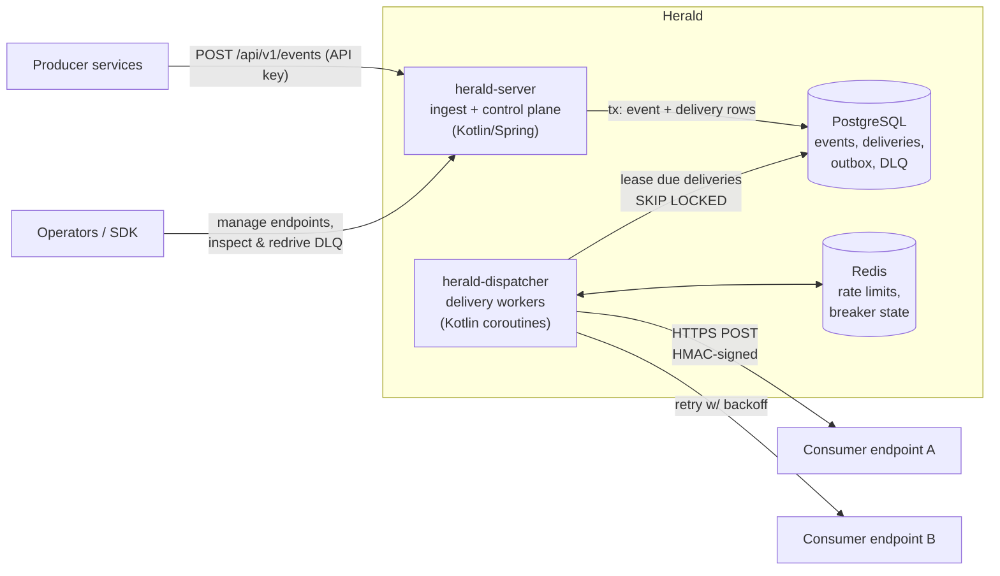

# Herald

**A self-hosted webhook delivery platform.** Producer services publish events to Herald; Herald guarantees signed, at-least-once delivery to consumer-registered HTTPS endpoints — with retries, dead-letter queues, and full delivery observability.

> **Status: pre-development.** Active build starts September 2026. The [project charter](docs/charter.md) defines scope, architecture, and roadmap. Watch this repo to follow along — each phase ships with a write-up.

## Why

Reliable webhook delivery is deceptively hard: consumers go down, endpoints hang, payloads must be tamper-proof, and one broken subscriber must never degrade the platform for everyone else. Herald is a from-scratch implementation of the patterns behind systems like Stripe's and GitHub's webhook infrastructure — built to be read, run, and learned from.

## What it will do

- **At-least-once delivery** with exponential backoff + jitter, and a dead-letter queue with redrive
- **Signed payloads** — timestamped HMAC-SHA256, replay protection, zero-downtime secret rotation
- **Multi-tenant control plane** — applications, endpoints, event types, API keys
- **Idempotent by design** — stable delivery IDs so consumers can safely dedupe
- **Isolation** — per-endpoint rate limits and circuit breakers
- **Observability** — delivery-status API, OpenTelemetry traces from ingest to final attempt

## Architecture at a glance

Kotlin + Spring Boot 3 services, PostgreSQL as store and v1 delivery queue (transactional outbox + `FOR UPDATE SKIP LOCKED`), Redis for rate-limit/breaker state, and an official Python SDK. Full reasoning in the [charter](docs/charter.md); design decisions land in [`docs/adr/`](docs/adr/).

## Roadmap

| Phase | When | Focus |
|---|---|---|
| 0 | Sept 2026 | Scaffold, CI, ADRs, OpenAPI draft |
| 1 | Sept–Oct | Control plane, ingest with transactional outbox, first end-to-end delivery |
| 2 | Oct–Nov | Reliability core: retries, DLQ + redrive, signing, rate limits, circuit breakers |
| 3 | Nov | Python SDK, demo consumer, load tests |
| 4 | Dec | Observability polish, Kubernetes deploy, read-only dashboard, write-ups |

## License

[MIT](LICENSE)
