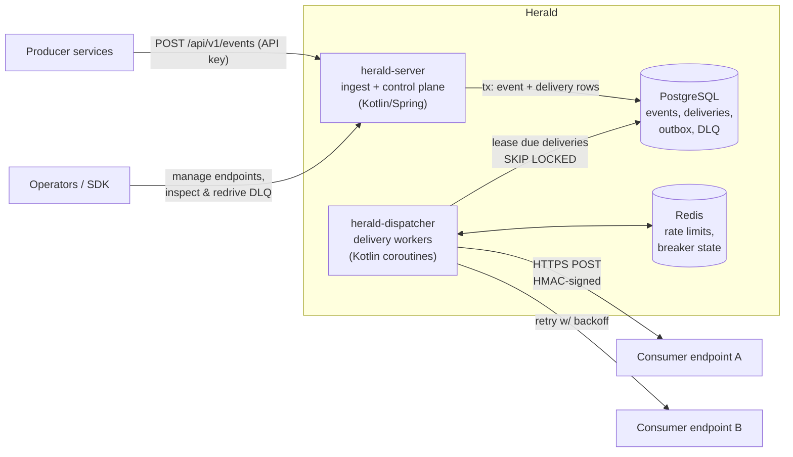

# Herald — Webhook Delivery Platform (Project Charter)

**Owner:** Steven Ang
**Repository:** https://github.com/stevenang/herald (public, PR-based workflow — live as of 2026-08-15)
**Timeline:** September 2026 → end of December 2026 (ongoing side project)
**Goal:** A portfolio project that positions Steven as a **Senior Software Engineer (Platform/Backend)**, deliberately counter-weighting the "Senior Data Engineer" perception.
**Status:** Charter agreed 2026-08-15 · open questions resolved 2026-08-15 (see §6)

---

## 1. What we plan to do

Build **Herald**, a self-hosted webhook delivery platform (in the spirit of Svix or Stripe's webhook infrastructure). Producer services publish events to Herald; Herald guarantees reliable, secure delivery of those events to consumer-registered HTTPS endpoints.

Core capabilities (the product contract):

- **Multi-tenant control plane** — tenants create *applications*, register *endpoints*, define *event types*, and manage signing secrets and API keys.
- **Event ingestion API** — producers POST events; Herald durably persists them before acknowledging (no accepted event is ever lost).
- **At-least-once delivery** — HTTP POST to each subscribed endpoint, with exponential backoff + jitter retries on failure.
- **Payload signing** — HMAC-SHA256 signatures with timestamps to prevent tampering and replay attacks; secret rotation without downtime.
- **Dead-letter queue & replay** — deliveries that exhaust retries land in a DLQ; operators can inspect and redrive them via API.
- **Idempotency** — stable delivery IDs in headers so consumers can safely dedupe.
- **Per-endpoint protections** — rate limiting and circuit breakers so one slow/broken consumer can't degrade the platform.
- **Delivery observability** — a status API (plus a minimal read-only dashboard in Phase 4) answering "what happened to my event?"
- **Official Python SDK** — publisher client + signature-verification helpers for consumers.

Explicit non-goals (v1): exactly-once delivery (impossible over HTTP; we document why), guaranteed global ordering (best-effort; per-endpoint FIFO is a stretch goal), a full-featured web UI, and any form of event analytics/warehousing (deliberately out — this is not a data project).

## 2. Why this is important

**Career rationale.** The rejection feedback was "reads as Senior Data Engineer, not Software Engineer." Data-engineering portfolios star *data movement* (pipelines, ETL, orchestration). Herald stars *system design*: API contracts, concurrency, failure handling, multi-tenancy, and developer experience. Every hard problem in this project is a classic backend/platform interview topic — delivery semantics, backpressure, hot tenants, retry storms, secret rotation. It gives Steven a concrete artifact to anchor system-design interviews with ("here's how I handled X in Herald, and here's the ADR where I weighed the alternatives").

**Technical rationale.** Webhook delivery is small enough for one person to build well in four months, yet deep enough that depth is never faked. It also demonstrates the exact skills platform teams hire for: designing an API other engineers depend on, publishing an SDK (a contract, not just code), and operating a service with real reliability guarantees.

**Why it's credible.** Every SaaS company needs this (Stripe, GitHub, Shopify all run one), so interviewers immediately understand the problem space — no domain explanation tax.

## 3. Components and languages

| Component | Language / Tech | What it proves |
|---|---|---|
| `herald-server` — control plane API + ingest API | **Kotlin + Spring Boot 3** | API design, validation, auth (API keys), multi-tenancy, persistence patterns |
| `herald-dispatcher` — delivery workers | **Kotlin** (same repo, separate deployable) | Concurrency (coroutines), job leasing, retries, circuit breakers, graceful shutdown |
| `herald-sdk` — official Python SDK | **Python 3.12+** | Developer experience, packaging (PyPI-ready), semantic versioning, signature verification |
| Demo consumer app + load harness | **Python (FastAPI + Locust)** | End-to-end proof; performance numbers for the README |
| Primary store + delivery queue (v1) | **PostgreSQL 16** | Transactional outbox, `FOR UPDATE SKIP LOCKED` job leasing, schema migrations (Flyway) |
| Rate limiting / circuit-breaker state | **Redis** | Distributed coordination beyond the database |
| Observability | **OpenTelemetry → Prometheus + Grafana + Tempo** | Traces across ingest→delivery, RED metrics, structured logging |
| CI/CD & runtime | **GitHub Actions, Docker Compose → Kubernetes (k3d/kind)** | Quality gates, Testcontainers integration tests, deploy story |
| Docs | **OpenAPI spec, ADRs, runbook** | Senior-engineer communication habits |

Language decisions (recorded as ADR-001/002 later):

- **Kotlin over Java** for the services: same Spring/JVM ecosystem enterprise employers care about, but with coroutines for the dispatcher's concurrency story and null-safety/data classes for cleaner domain modeling. Interview-friendly: "JVM + Spring, expressed in Kotlin."
- **Python confined to the SDK and test harness** — present, but clearly in a supporting role, so the project can't be read as a Python data project.
- **Postgres-as-queue first, Kafka later (maybe).** v1 uses a transactional outbox + `SKIP LOCKED` leasing: simpler ops, fully transactional, and a great ADR about *not* reaching for Kafka prematurely. If time allows, a Phase-4 spike swaps the queue behind an interface — demonstrating the abstraction was right.

Repo shape: one monorepo (`herald/`) with Gradle modules — `core` (domain), `server`, `dispatcher`, `sdk-python/`, `deploy/`, `docs/adr/`. Modular monolith with two deployables: microservice discipline without microservice theater.

## 4. High-level architecture

**Write path.** Producer POSTs an event with an API key. `herald-server` authenticates, validates against the event type schema, then in **one transaction** writes the event plus one pending-delivery row per subscribed endpoint (transactional outbox — the ack means "durably accepted, delivery guaranteed to be attempted").

**Delivery path.** `herald-dispatcher` workers lease due deliveries with `FOR UPDATE SKIP LOCKED` (safe horizontal scaling, no coordinator). Each attempt: check the endpoint's rate limit and circuit breaker in Redis → sign payload (HMAC-SHA256 with timestamp + delivery ID) → HTTPS POST with timeout → record attempt. 2xx completes the delivery; failure schedules the next attempt with exponential backoff + jitter; attempts exhausted moves it to the DLQ, where operators can inspect and redrive via the control plane.

**Key guarantees & mechanisms:**

- *At-least-once, never silent loss* — ack only after commit; every state transition is a recorded attempt.
- *Idempotency* — `Herald-Delivery-Id` header lets consumers dedupe; SDK ships a helper.
- *Security* — timestamped HMAC signatures (replay protection), dual-secret rotation windows, per-tenant API keys.
- *Isolation* — per-endpoint rate limits and circuit breakers stop a broken consumer from starving healthy ones; per-tenant fairness caps stop hot tenants.
- *Observability* — one trace spanning ingest → each delivery attempt; RED metrics per endpoint; delivery-status API.

**Scaling story (interview narrative):** v1 handles thousands of events/min on Postgres alone. The documented evolution path — partition the deliveries table, then swap the leasing layer for Kafka behind the existing interface — shows the design anticipated growth without paying for it up front.

## 5. Roadmap (Sept → Dec 2026)

- **Phase 0 — Sept:** repo scaffold, CI with quality gates, ADRs 001–004 (language, queue choice, delivery semantics, signing scheme), OpenAPI draft.
- **Phase 1 — Sept–Oct:** control plane CRUD + auth; ingest with transactional outbox; naive dispatcher; end-to-end happy path with Testcontainers.
- **Phase 2 — Oct–Nov:** the reliability core — retries/backoff, DLQ + redrive, idempotency, signing + rotation, rate limits, circuit breakers, graceful shutdown.
- **Phase 3 — Nov:** Python SDK + demo consumer; Locust load tests; publish performance numbers.
- **Phase 4 — Dec:** observability polish, Kubernetes deploy, runbook, README + architecture write-up, **minimal read-only dashboard**; stretch: Kafka spike or per-endpoint FIFO.

Each phase closes with a **blog post** documenting what was built and the design decisions behind it (see D4).

## 6. Decisions log (resolved 2026-08-15)

- **D1 — Public repo from day one.** The commit history is part of the portfolio: a green, steady contribution graph plus readable commit messages tell the "working engineer" story. Consequence: commit hygiene matters from commit #1 (conventional commits, PRs against own main with CI green).
- **D2 — Project name: Herald.** A herald's job is delivering messages — on-theme, distinctive, and low-collision ("Relay" was rejected: it collides with Meta's Relay GraphQL framework and webhookrelay.com, a commercial product in this exact space; "Dispatch" collides with Netflix's incident-management tool; "Courier" collides with trycourier.com, a notification-infrastructure company).
- **D3 — Minimal read-only dashboard in Phase 4.** A small read-only UI over the delivery-status API (deliveries by endpoint, attempt timelines, DLQ browser). Kept deliberately thin — the API remains the product; the dashboard is a demo surface that makes screenshots/videos and the blog posts far more compelling. Still not a full-featured UI (non-goal stands).
- **D4 — Blog post per phase (committed).** One post at the close of each phase (~5 posts total). These compound the project's value: they are the interview narrative written down, they demonstrate communication skills, and they give recruiters something skimmable. Budgeted into each phase's scope — a phase is not "done" until its post is drafted.